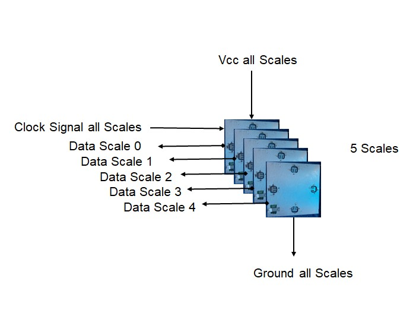

# HX711 Single Clock

An Arduino library to interface the HX711 24-Bit Analog-to-Digital Converter (ADC)] for reading load cells / weight scales.  This is a very simple library that uses a single clock for all HX711 devices.  This reduces the number of pins required to work with multiple HX711 devices.

This library supports all the available features on the HX711.   Gain options are 128, 64, and 32.  Access to Channels A  and Channel B.  Sample rates up to 10 Samples per Second.  The library supports upto 8 HX711 devices.

To use Channel B the gain must be set to 32.  Channel A is used if the gain is 128 or 64.

The library reads the scales at a bit rate of about 25 kHz which reduces glitches when longer cables are used.

## Code Example

#include <HX711_Single_Clk.h>

#define number_of_HX711_devices 3

#define  ClockPin 25 

#define Gain 128

int ScaleInPins[] = {34, 35, 36};               //Processor Input Pins from Scales (maximum 8)

long ScaleReadings[number_of_HX711_devices]  //Array to hold HX711 readings

HX711O Scales(number_of_HX711_devices);   //constructor array size

Scales.begin(ClockPin, ScaleInPins, Gain);

Scales.getData(ScaleReadings);    // If time out occurs reading is -1

**See Example for more details**

## Hardware Sample

## Hardware Support

This library should support all Arduino compatible boards.  It was tested on ESP32, ESP8266 and Mega platforms.

## Manual Library Install

Since this library is not in the Arduino database you need to do a manual install.  The following are the instructions:

1. Download the library by selecting the code button and select download zip.

2. Go to the directory where you have downloaded the .zip library file.

3. Extract the .zip file.

4. Select the main folder (it should have the library’s name) and move it to the “libraries” folder.   It is in the Documents\Arduino\libraries folder.  You need to remove "-main" on the folder name.

## Similar libraries

There are other libraries around, enjoy:

- [GitHub - olkal/HX711_ADC: Arduino library for the HX711 24-bit ADC for weight scales](https://github.com/olkal/HX711_ADC).
